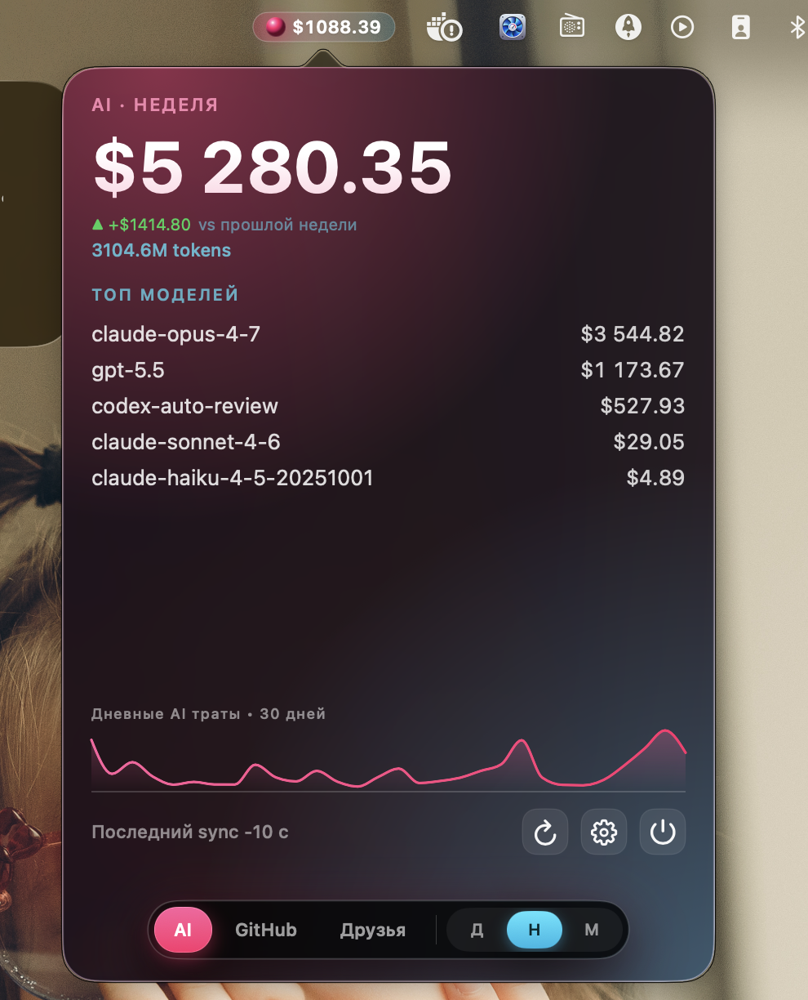
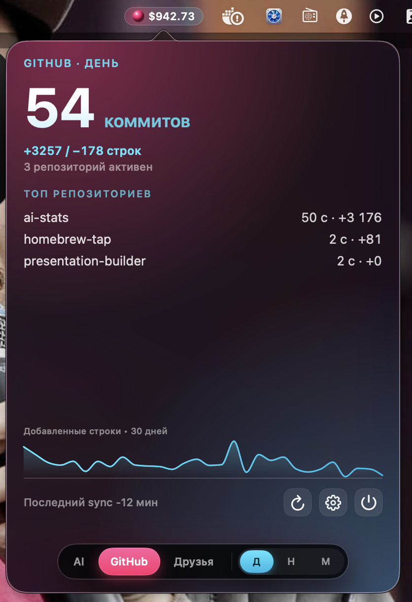
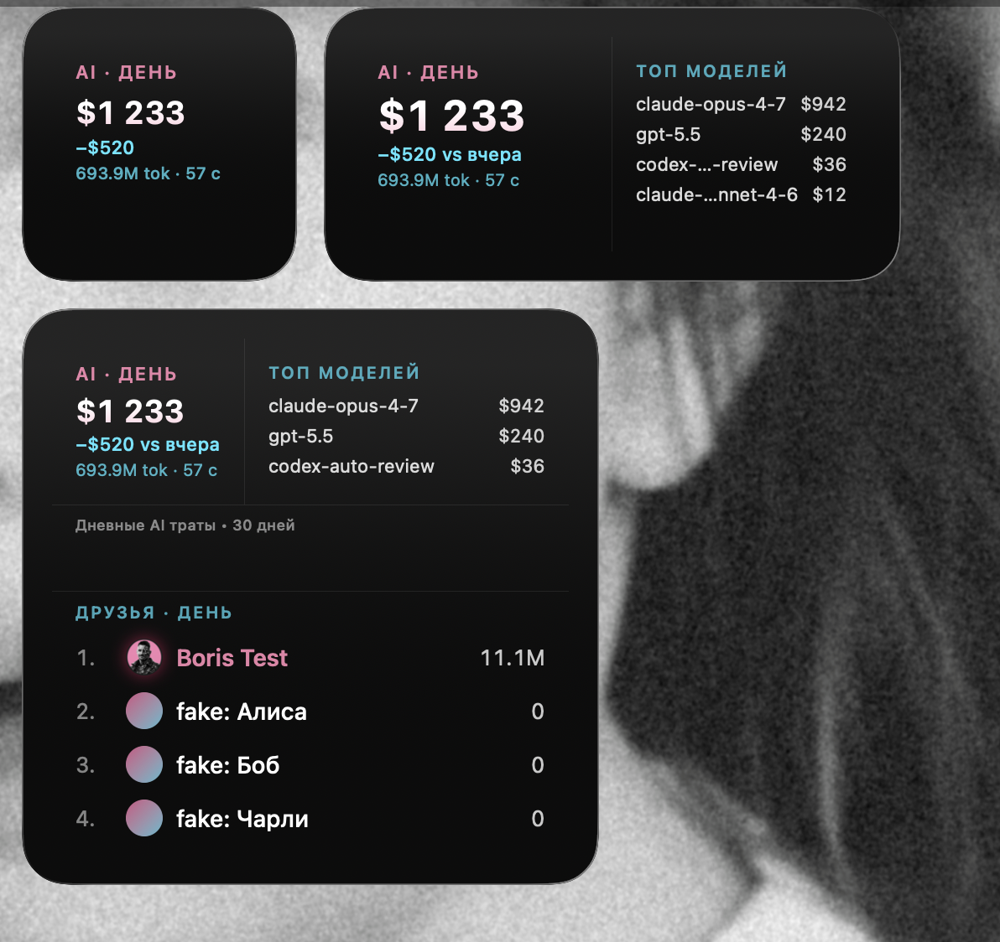

# Burn

[](https://github.com/tsergeytovarov/ai-stats/releases/latest)
[](https://www.apple.com/macos/)
[](https://github.com/tsergeytovarov/homebrew-tap)
[](LICENSE)

macOS menu bar app для статистики трат на AI-агентов.

```bash
brew tap tsergeytovarov/tap
brew trust --cask tsergeytovarov/tap/ai-stats
brew install --cask ai-stats
```

> **Статус:** personal MVP. Внутренние идентификаторы (bundle ID `com.sergeytovarov.aistats`, пути `~/.config/ai-stats/`) под Burn не переименованы — ренейминг ломает Keychain и app-group-контейнер у установленных копий, поэтому отложен на отдельный релиз с миграцией. На пользователя смотрит уже **Burn**: capsule в menu bar и имя Burn в Spotlight. Иконки в Dock и в Cmd+Tab нет — это menu-bar-only приложение.

**Визуал:** редизайн под Apple Liquid Glass — pink+cyan палитра с внутренним brand-градиентом (не зависит от обоев), floating glass island для периода, виджеты на едином visual language.

## Что показывает

Popover — две вкладки: **Расходы** и **Аналитика**.

**Расходы:**

- Сегодняшние / недельные / месячные траты по AI-агентам (Claude Code, Codex, opencode) через `ccusage` + собственный pricing table (USD за 1M токенов, актуально на 2026 год, вкл. claude-opus/sonnet/haiku 4.x и gpt-5.x).
- Топ моделей за выбранный период с разбивкой по стоимости.
- 30-дневный sparkline-тренд AI-трат.
- Виджеты на десктопе (Small / Medium / Large): сумма за период с дельтой vs прошлый период; в Medium и Large — ещё и топ моделей.

**Аналитика** (за фикс-окно 30 дней) — советник по выбору модели: читает историю Claude Code и Codex локально и показывает, где дорогая модель тратилась на задачу, которую потянула бы модель дешевле.

- Сколько денег «утекает» на переусложнённых моделях и сколько лимита это съедает.
- Главные утечки: регулярные задачи и роли пайплайнов на дорогой модели + конкретный совет, чем заменить.
- Топ-6 моделей за 30 дней по числу токенов (не по деньгам).
- Шпаргалка: какую модель под какую задачу.

> **Приватность аналитики.** Разбор истории агентов идёт полностью на устройстве. Тексты промптов (обрезанные до 300 символов) хранятся только в локальной БД и на сервер не уходят.

## Скриншоты

**Popover** — клик по capsule в menu bar открывает дроп с двумя вкладками (Расходы / Аналитика). Floating island внизу переключает период (День / Неделя / Месяц):

| Расходы · неделя | Расходы · месяц |
|---|---|
|  |  |

**Виджеты** на десктопе — Small, Medium, Large вместе:



## Требования

- macOS 26 Tahoe или новее.
- Node.js (для `npx ccusage`) или [bun](https://bun.sh/) (`bunx ccusage`) — иначе не будет AI-статистики.

## Установка

### Через Homebrew Cask (рекомендуется)

```bash
brew tap tsergeytovarov/tap
brew trust --cask tsergeytovarov/tap/ai-stats
brew install --cask ai-stats
```

`brew` скачает DMG, проверит SHA256, поставит `Burn.app` в `/Applications/`. Никакого Gatekeeper warning'а — cask автоматически снимает quarantine-атрибут.

> **Шаг `brew trust`.** Homebrew вводит обязательный trust для сторонних (не official) тапов: opt-out `HOMEBREW_NO_REQUIRE_TAP_TRUST` помечен deprecated и будет удалён в одном из следующих релизов. `brew trust --cask tsergeytovarov/tap/ai-stats` доверяет каск один раз (запись в `~/.homebrew/trust.json`); `brew untrust` отменяет. Команда появилась в Homebrew 5.1.15 — на более старых brew её ещё нет, там шаг можно пропустить.

Обновления:

```bash
brew upgrade --cask ai-stats
```

### Прямым скачиванием DMG

1. Скачать последний DMG из [Releases](https://github.com/tsergeytovarov/ai-stats/releases/latest).
2. **Важно:** при первом открытии macOS покажет alert «Apple не может проверить разработчика» — приложение подписано ad-hoc, без Apple Developer ID. Чтобы запустить:
   - **Способ 1:** Right-click на `Burn.app` в Finder → Open → Open. Один раз.
   - **Способ 2 (CLI):** `xattr -dr com.apple.quarantine /Applications/Burn.app`

После этого `Burn.app` запускается двойным кликом как обычно.

## Первый запуск

Запусти Burn из `/Applications` или через Spotlight. Иконки в Dock нет — приложение живёт только в menu bar: ищи capsule с суммой трат в правом верхнем углу экрана. Клик по нему открывает popover с детализацией.

При первом старте Burn создаёт `~/.config/ai-stats/config.json` и показывает алерт «Конфиг создан» с кнопкой «Открыть конфиг». Ничего заполнять не обязательно — статистика по AI-агентам работает из коробки.

## Разрешения и пароли

Burn не в App Sandbox и не просит доступ к камере, микрофону или контактам. Что реально потребуется:

### Пароль на старте (Keychain)

При первом запуске после установки (и после каждого апдейта) macOS показывает диалог «`Burn` хочет получить доступ к `Local Items` keychain — введите пароль». Жми **Always Allow** один раз — больше не спросит до следующего апдейта.

Причина: app подписан ad-hoc (без $99/год Apple Developer ID). macOS определяет «доверенность» app'а через подпись бинаря; для ad-hoc это означает, что **любая пересборка** = новая identity = invalidated trust → новый prompt. Что сделано, чтобы prompt'ов было меньше:

- Оба секрета (aiuse api_secret + GitHub PAT) лежат в одном Keychain item'е (`tech.popovs.aistats.secrets`). До v0.4.0 было два item'а → два prompt'а. Теперь один на запуск.
- Все Keychain reads делаются разово на старте + кешируются в памяти процесса. Синки каждые 15 минут Keychain не дёргают.

Полностью без prompt'ов — только если подписать app настоящим Developer ID cert'ом, что упирается в Apple Developer Program ($99/год + иностранная карта для оплаты из РФ).

### Доступ к файлам

Burn читает свой конфиг (`~/.config/ai-stats/`), локальную БД и историю CLI-агентов, которую считает `ccusage`. Ничего из этого не требует системного prompt'а. Без логина на сервер не уходит ничего (см. [Приватность](#приватность)).

### Подтверждение автозапуска

Если включишь «Запускать при входе» — macOS может попросить разрешение в System Settings → General → Login Items (см. [Автозапуск](#автозапуск)).

## Аккаунт

Settings → «Аккаунт» → **«Войти через GitHub»** проводит OAuth-вход: откроется браузер, авторизуешься на GitHub, и Burn вернётся по ссылке `burn://`. Вход создаёт аккаунт и подтягивает аватарку с GitHub; имя можно поменять там же. Аккаунт опциональный — вся статистика трат работает и без него.

## Приватность

Burn считает траты полностью локально — данные лежат в БД на твоём Mac'е и на сервер не уходят.

## Виджет

Burn даёт виджеты Small / Medium / Large. Добавить: right-click по рабочему столу → «Редактировать виджеты» (или открой Notification Center → «Изменить виджеты»), найди **Burn**, перетащи нужный размер. Период (День / Неделя / Месяц) меняется в настройках виджета — right-click по нему → «Изменить виджет».

- **Small** — сумма за период с дельтой vs прошлый период.
- **Medium** — то же плюс топ моделей.
- **Large** — то же с более полным списком моделей и трендом.

## Автозапуск

Settings → «Общие» → «Запускать Burn при входе в систему». Toggle регистрирует app в macOS Login Items через `SMAppService.mainApp`; управлять можно и из System Settings → General → Login Items.

При первом включении macOS может попросить approval — тогда переключатель отобьёт обратно, и в системных настройках появится pending-запись, которую надо разрешить руками.

## Если что-то не так

- **macOS просит пароль при каждом запуске.** Это ad-hoc подпись, не баг — см. [Разрешения и пароли](#разрешения-и-пароли). Лечится только настоящим Developer ID.
- **AI-траты по нулям.** Нужен Node.js (или bun) в PATH — Burn зовёт `npx ccusage`. Проверь `npx ccusage` в терминале. Считаются только CLI-агенты (Claude Code, Codex CLI, opencode); web ChatGPT/Claude.ai — нет.

---

## Конфиг (справочник)

При первом запуске app создаст `~/.config/ai-stats/config.json` (с правами `0600`). Для трат по AI-агентам ничего заполнять не надо.

```json
{
  "sync_interval_minutes": 15,
  "ccusage_command": ["npx", "-y", "ccusage@20"],
  "enabled_providers": ["claude", "codex", "opencode"],
  "providers_migration": 1,
  "aiuse_api_base_url": "https://aiuse.popovs.tech/api"
}
```

**`enabled_providers`** — агенты, которых считает ccusage (`claude`, `codex`, `opencode`; сам ccusage знает и другие). Провайдер без данных ничего не стоит: он вернёт пустой отчёт. `providers_migration` — служебное поле: по нему app понимает, что новых провайдеров в дефолте с прошлого запуска не появилось. Удалишь провайдера из списка — миграция не вернёт его обратно.

Поля `github_token` / `github_login` остаются как legacy: если они есть в конфиге, при старте app перенесёт токен в Keychain (`tech.popovs.aistats.secrets`, account `combined-v1`) и затрёт поле в JSON — plaintext-токен не остаётся на диске. Вход через GitHub делается из Settings → «Аккаунт» и конфиг для этого не нужен.

**Безопасность `aiuse_api_base_url`.** Только `https://`. Любая другая схема — app откажется стартовать (Bearer-токен из Keychain не должен утечь plain-text'ом).

**Версия `ccusage` запиннена** (`ccusage@20`, не `@latest`) — supply-chain protection. Менять руками когда выйдет major 21+ и захочешь обновиться. `npx -y` всё ещё резолвит patch'и внутри 20.x.x.

Менять остальные поля можно — но имей в виду, что каждый sync запускает `npx ccusage` процесс на 10-30 секунд.

## Где живут файлы

- DB: `~/Library/Group Containers/group.com.sergeytovarov.aistats/stats.db` (app-group-контейнер — базу шарит виджет)
- Config: `~/.config/ai-stats/config.json`
- Keychain: `tech.popovs.aistats.secrets` / `combined-v1` (aiuse + github в одном JSON)

## Известные ограничения

- **ChatGPT/Claude.ai web** не поддерживаются — у них нет публичного API использования. Только CLI-агенты (Claude Code, Codex CLI, opencode) через [ccusage](https://ccusage.com).
- **$ это «API-equivalent».** Реально на подписках $20-200/мес ты платишь меньше; цифра показывает сколько стоила бы та же нагрузка по API.

## Для разработчиков

Требования для сборки: Xcode 15+, [xcodegen](https://github.com/yonaskolb/XcodeGen) (`brew install xcodegen`), [create-dmg](https://github.com/create-dmg/create-dmg) (`brew install create-dmg`, только если собираешь DMG).

### Сборка из исходников

```bash
xcodegen generate
xcodebuild -project ai-stats.xcodeproj -scheme StatsApp \
  -configuration Release -derivedDataPath build/
open build/Build/Products/Release/Burn.app
```

Или открыть `ai-stats.xcodeproj` в Xcode и собрать через GUI.

Готовый DMG:

```bash
./scripts/build-dmg.sh
# build/burn-X.Y.Z.dmg + SHA256 в выводе
```

### Спек и план

- Дизайн v1.0 (выпил GitHub/друзей, подсистема Аналитики): [docs/spp/04-specs/2026-07-11-burn-next-design.md](docs/spp/04-specs/2026-07-11-burn-next-design.md)
- Исходный дизайн v0.1: [docs/superpowers/specs/2026-05-22-ai-stats-design.md](docs/superpowers/specs/2026-05-22-ai-stats-design.md)
- План реализации v0.1: [docs/superpowers/plans/2026-05-22-ai-stats-v0.1.md](docs/superpowers/plans/2026-05-22-ai-stats-v0.1.md)

## Лицензия

[MIT](LICENSE). Copyright © 2026 Sergey Tovarov.
